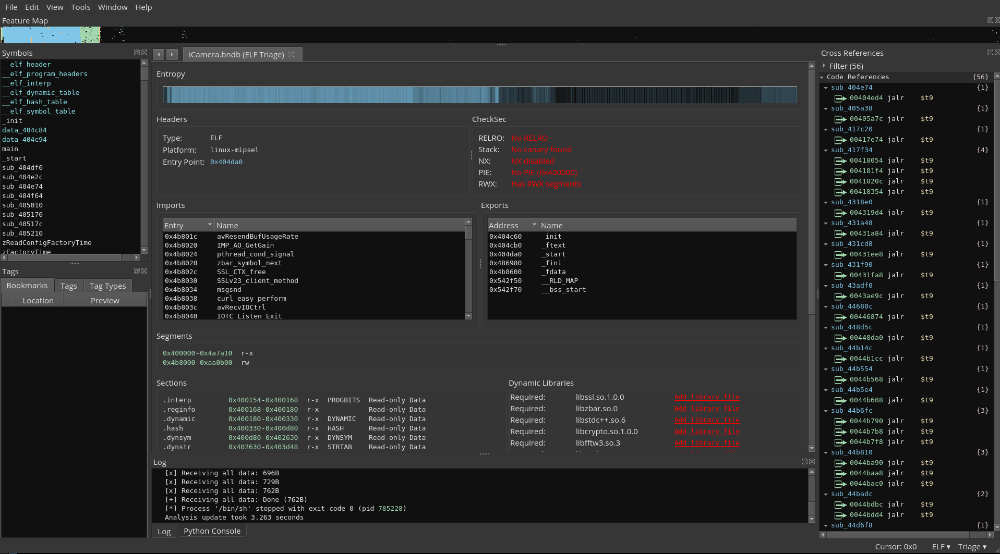
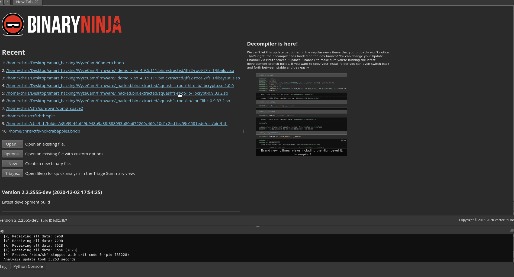
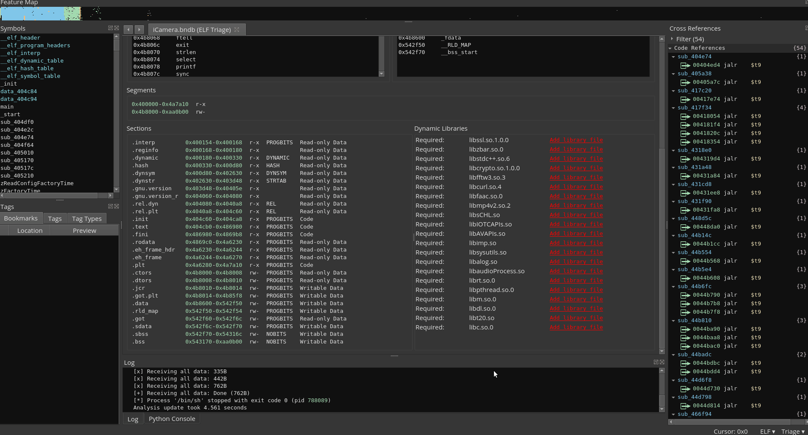
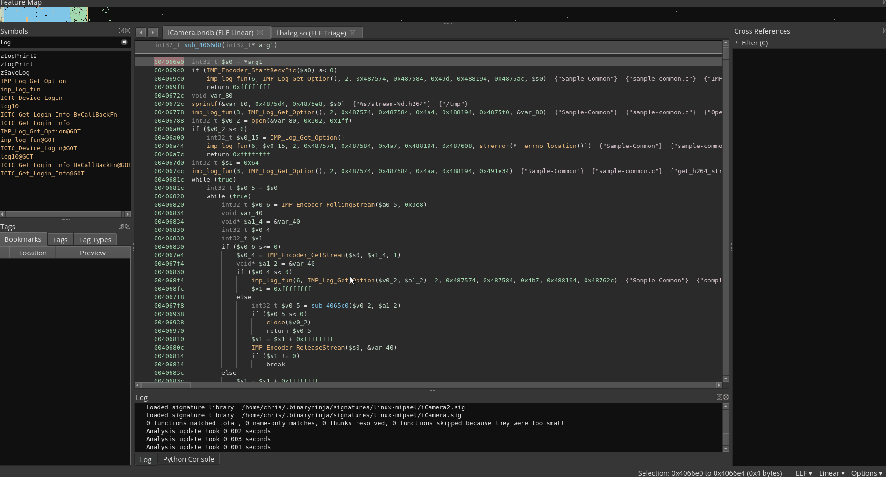

# Triage
Author: **Vector 35** and chris

## Description
* Added Checksec to Triage View
* Enabled linking of shared libraries to navigate back anf forth between them

## Installation

Clone this to your plugin repo and remove libtriage.so from you installation plugin repo to use mine over theirs

## Minimum Version

This plugin requires the following minimum version of Binary Ninja:

 * release - N/A
 * dev - 1560 or newer

## License

This plugin is released under a [MIT](LICENSE) license. ? idk

## Uses

# Enables CheckSec and displayes all required libs

# Add Library to binary

# Follow Call 
If I was trying to analyze this binary and ran into the function `imp_log_fun` and wanted to know what it does
